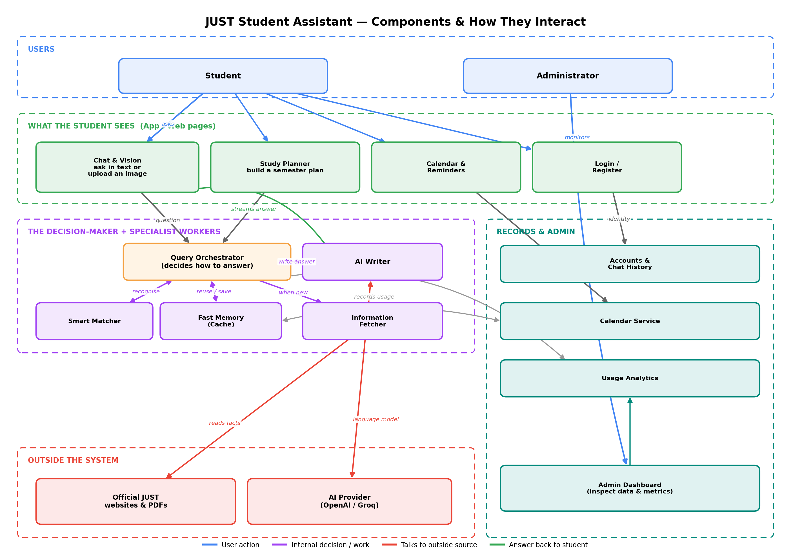
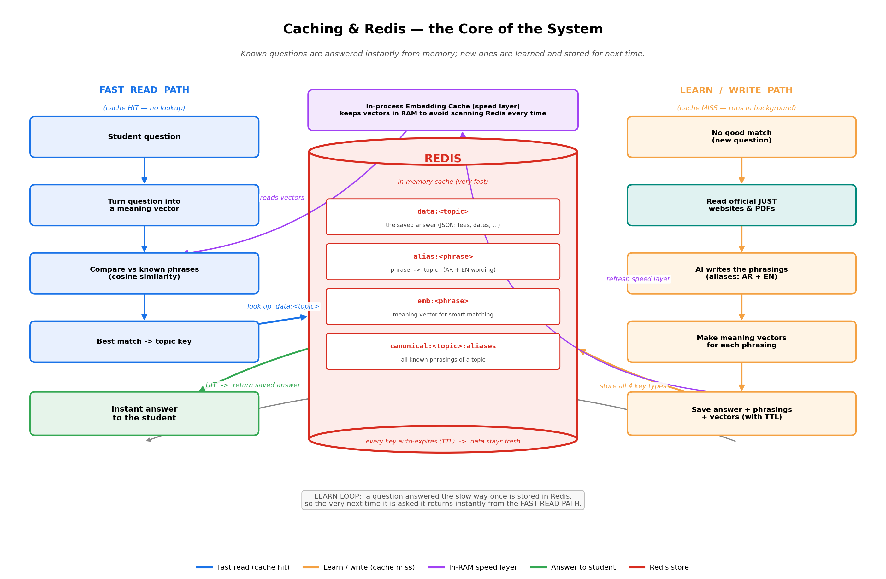
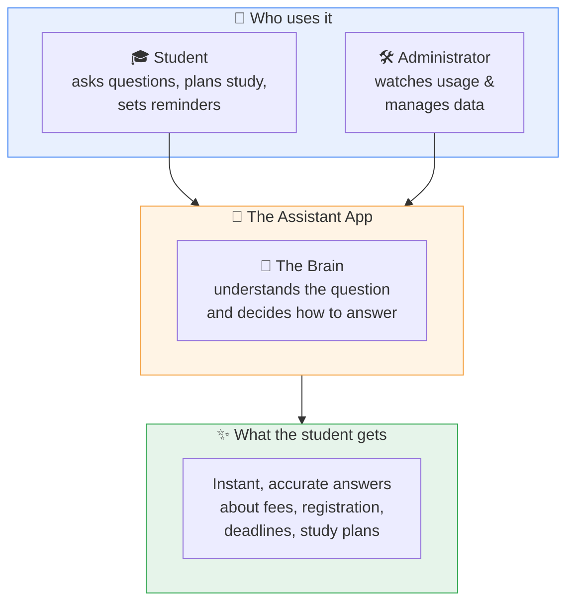
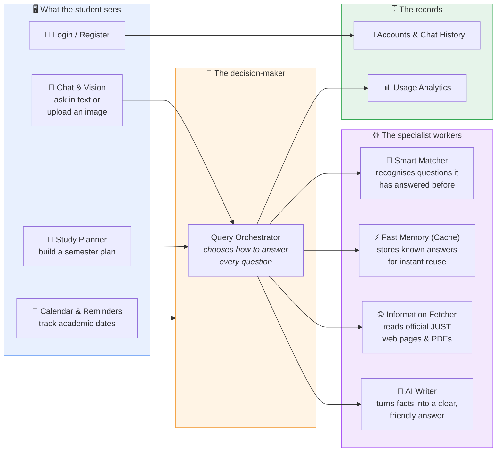
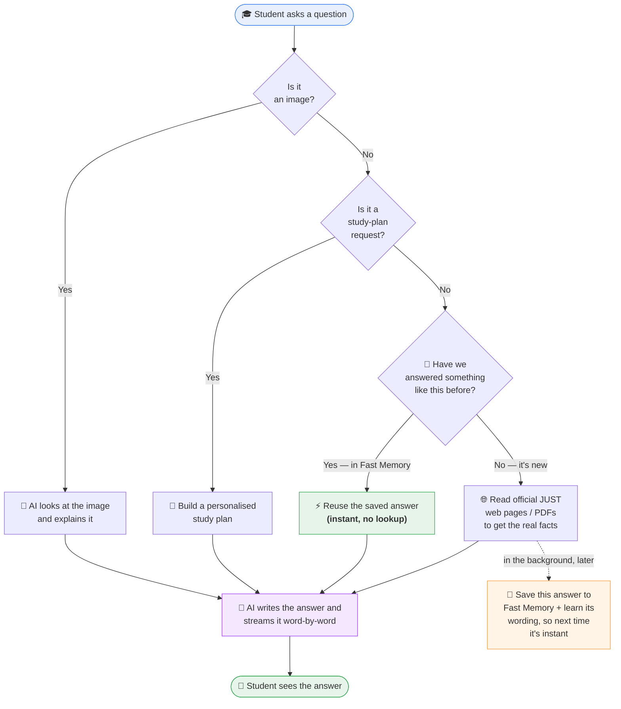
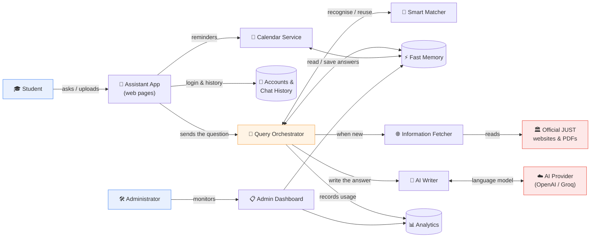
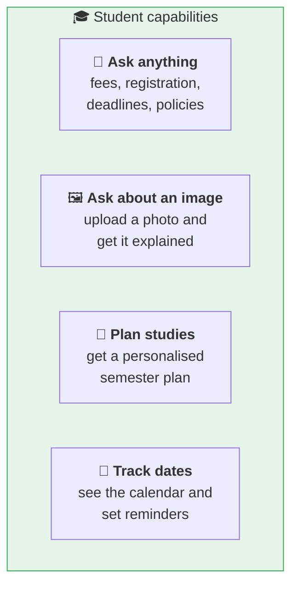

# JUST Student Assistant — Business Logic

A plain-language map of **what the system does, what each part is responsible for, and how the parts work together.**
This document is meant for a non-technical reader (client / stakeholder): it explains the *business behind the buttons*, not the code.

> The system is a smart assistant for students of **Jordan University of Science & Technology (JUST)**.
> A student can **ask any university question, attach a picture, plan their study schedule, and track academic calendar deadlines** — all from one chat-style app.

---

## Component diagram — at a glance

The drawing below shows every general component and how each one deals with the others.
Colours show the *type* of interaction (user action, internal work, outside source, answer back).

*Source: regenerate any time with `python docs/draw_business_logic.py`.*

---

## Caching & Redis — the core of the system

The single most important idea in the product is its **memory**. The diagram below zooms in on it:
how Redis stores knowledge, how a known question is answered **instantly**, and how a new question
is **learned** and saved so it becomes instant next time.

**What Redis keeps (4 kinds of records):**

| Record | Plain meaning |
|--------|---------------|
| `data:<topic>` | The actual saved answer (fees, dates, policies …) as structured data. |
| `alias:<phrase>` | A known phrasing mapped to its topic — covers both Arabic and English wording. |
| `emb:<phrase>` | A "meaning fingerprint" of a phrase, so similar questions match even if worded differently. |
| `canonical:<topic>:aliases` | The full list of phrasings that point to one topic. |

**Why this is the heart of the system:**

- **Two layers of speed** — an in-RAM layer holds the meaning-vectors so the system doesn't even scan Redis on every question, and Redis itself is an in-memory store (millisecond reads).
- **Instant on repeats** — if a question matches something already known, the saved answer comes straight back with **no web lookup and no AI cost**.
- **It learns automatically** — a brand-new question is answered the slower way once, then quietly stored (answer + phrasings + vectors). The *next* student asking the same thing gets the instant path.
- **Always fresh** — every stored record auto-expires after a set time (TTL), so cached answers can't go stale.

*Source: regenerate any time with `python docs/draw_caching.py`.*

---

## 1. The big picture (what the product is)

**In one sentence:** a student types a question, the system decides the *fastest reliable way* to answer it, and streams the answer back word-by-word like a chat.

---

## 2. The main building blocks (each component, in business terms)

| Component | What it is responsible for (business value) |
|-----------|-----------------------------------------------|
| **Chat & Vision** | The main door. Student asks in plain Arabic/English, or uploads a photo (e.g. a fee table) to ask about it. |
| **Study Planner** | Helps a student build a personalised semester study plan based on their program and profile. |
| **Calendar & Reminders** | Shows official academic calendar events and lets students set personal reminders. |
| **Login / Register** | Identifies the student so their chat history and reminders are saved and private. |
| **Query Orchestrator** | The "manager." For every question it decides: *Do we already know this? Should we look it up? How do we answer fastest?* |
| **Smart Matcher** | Recognises that "كم الرسوم" and "what are the fees" mean the same thing, so old answers can be reused. |
| **Fast Memory (Cache)** | Keeps answers we've already prepared, so repeated questions return **instantly** and cost nothing extra. |
| **Information Fetcher** | When something is new, it reads the **official JUST sources** (web pages / PDFs) to get real, current facts. |
| **AI Writer** | Takes the facts and writes a clear, complete, human-sounding answer — streamed live to the student. |
| **Accounts & Chat History** | Safely stores who the user is and what they discussed. |
| **Usage Analytics** | Records what students ask, so administrators understand demand and quality. |

---

## 3. How a question gets answered (the core business flow)

This is the heart of the product — the logic that makes it **fast *and* accurate**.

**Why this design matters to the client:**

1. **Speed** — Known questions are answered from Fast Memory instantly; the student never waits.
2. **Accuracy** — New questions are answered from **official JUST sources**, not guesses.
3. **It gets smarter over time** — Every new question is quietly saved and "learned" in the background, so the *next* student asking the same thing gets an instant answer.
4. **One experience, many needs** — text, images, study plans, and reminders all flow through the same friendly chat.

---

## 4. How the parts talk to each other (interaction overview)

| Interaction | What's happening in business terms |
|-------------|-------------------------------------|
| Student → App → Orchestrator | The question enters the system and reaches the decision-maker. |
| Orchestrator ↔ Smart Matcher / Fast Memory | "Do we already know this?" — reuse if possible. |
| Orchestrator → Fetcher → Official JUST sources | If new, go get the **real, current facts** from the university. |
| Orchestrator → AI Writer ↔ AI Provider | Turn facts into a clear answer, streamed back live. |
| App → Accounts / Calendar | Keep the student's identity, history, and reminders safe and personal. |
| Orchestrator → Analytics; Admin → Dashboard | Administrators see what's being asked and can inspect the saved answers. |

---

## 5. The four things a student can actually do

Each of these is powered by the same engine in section 3 — the student just experiences it as four simple features.

---

### Summary for the client

> The JUST Student Assistant works like a **knowledgeable university help-desk that never sleeps and keeps getting smarter.**
> It answers known questions **instantly** from memory, looks up **new ones from official sources**, explains **images**, builds **study plans**, and tracks **deadlines** — all in one chat. Behind the scenes it quietly learns from every question, so the service becomes faster and more complete the more it's used.

*Companion to the technical [`ARCHITECTURE.md`](./ARCHITECTURE.md), which covers the engineering detail.*
